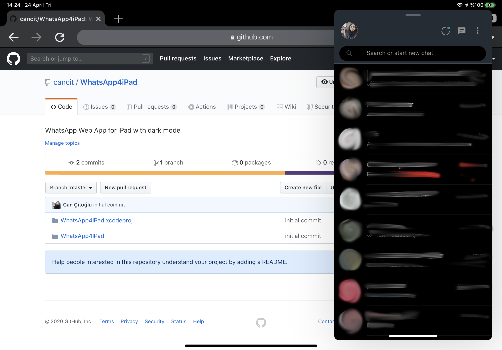
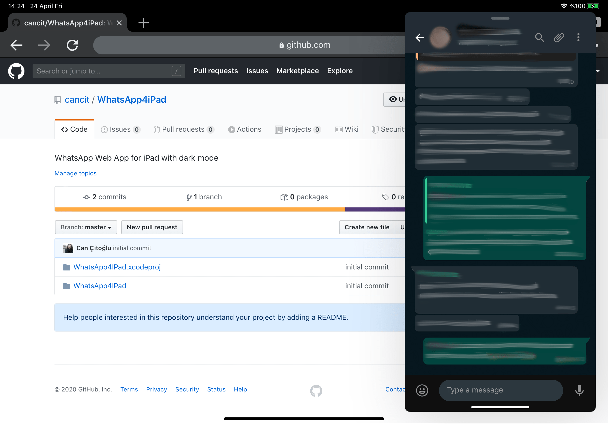

# WhatsApp4iPad
WhatsApp Web App for iPad with dark mode

## Features
* Dark Mode - mostly, not fully adjusted -
* Split View Support - mobile like experience -
* Single-tap opens chat - normally, website requires two taps -

## Screenshots

## Known Issues
* Single-tap stops working if WhatsApp Web opened in a different browser and you click "Use Here" on iPad
* Does not support voice recording
* QR code page is not fully dark

## References
* https://github.com/0xFaul/WhatsAppForiPad

## Author
Can Çitoğlu: [cancit.com](https://cancit.com)
